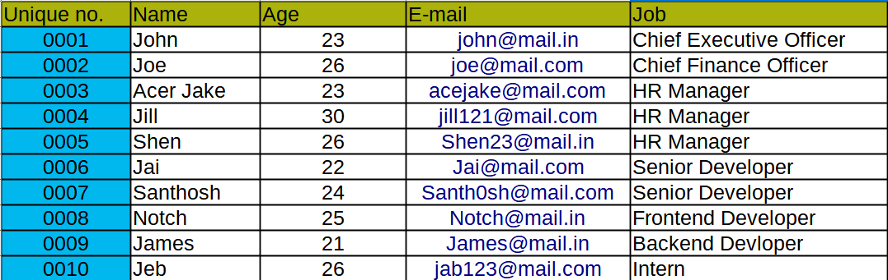

# Django ORM Web Application

## AIM
To develop a Django application to store and retrieve data from a database using Object Relational Mapping(ORM).

-----
## Entity Relationship Diagram
 

-----
## DESIGN STEPS
### STEP 1:
- [x] Create a django application using ```django-admin startapp <appname>``` in command line.
- [X] Head to the application directory created inside the project directory. Open the models.py file.
- [X] In models.py create two classes one defining the attributes and the other one defining attribute value types.

### STEP 2:
- [X] In the same directory, Head to admins.py and import the two classes from models.py that you have created earlier.
- [X] Now register your created models in admins.py file and save both the files.

### STEP 3:
- [X] Start the Django server and head over to admin page.
- [X] Using the admin interface, you can add or delete data in the database.
-----

## PROGRAM
### File: Models.py
```python
from django.db import models
from django.contrib import admin

class Employee (models.Model):
    unique_number=models.CharField(max_length=20,primary_key=True)
    name=models.CharField(max_length=100)
    age=models.IntegerField()
    email=models.EmailField()
    job=models.CharField(max_length=100)

class EmployeeAdmin(admin.ModelAdmin):
    list_display=('unique_number','name','age','email','job')
```

### File: Admin.py
```python
from django.contrib import admin
from .models import Employee,EmployeeAdmin

admin.site.register(Employee,EmployeeAdmin)

```
---
## OUTPUT


### Verifying Primary-key 


----

## RESULT 
A Django application has been created that can be used to store and retrieve data from the database using Object Relational Mapping(ORM).

